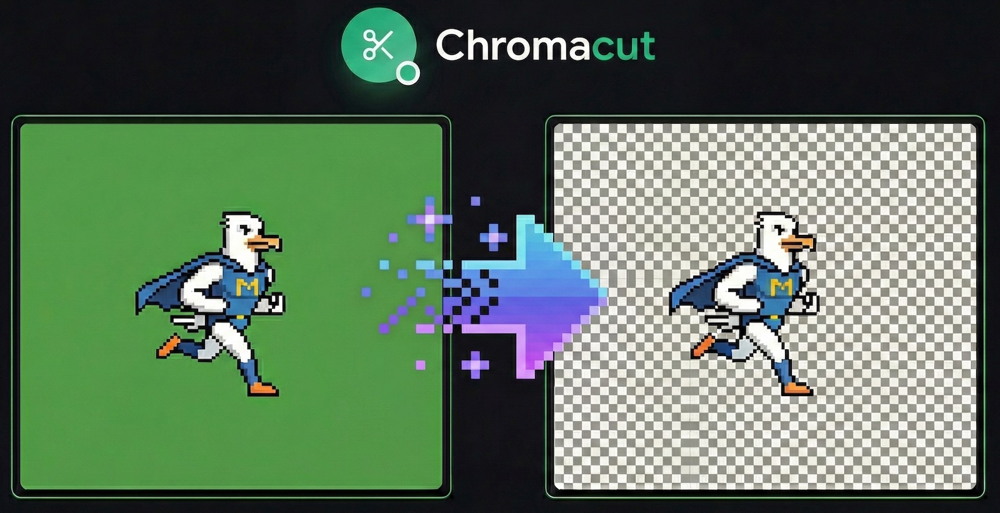

# Chromacut

Remove colored backgrounds from AI-generated images with chroma key.

**[Try it live →](https://chromacut.1h12.com)**

## Features

- 🎨 **Chroma key** - Remove any color background with adjustable tolerance
- ✂️ **Crop & trim** - Auto-trim transparent pixels when cropping
- 🧹 **Eraser** - Manual touch-up with adjustable brush size
- 📚 **Layers** - Save multiple crops as separate layers
- ↩️ **Undo/Redo** - Full history support
- 📤 **Export** - Download as PNG at various sizes (0.25x to 2x)
- 🌙 **Dark mode** - Easy on the eyes

## Tech

React 19 · Vite · Tailwind CSS · Zustand · Radix UI

## License

MIT
